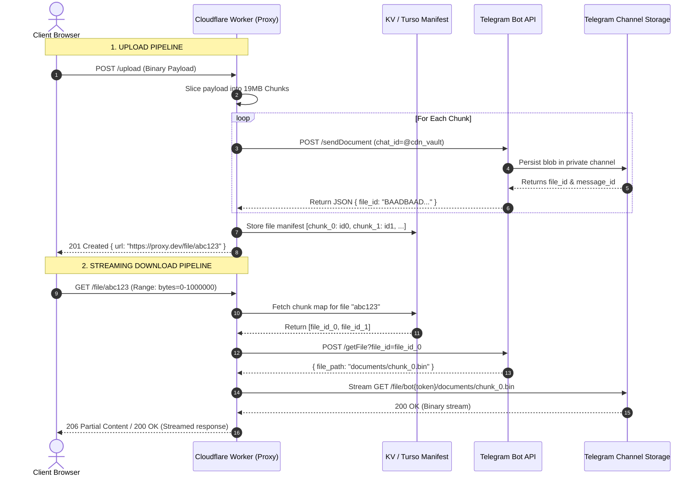
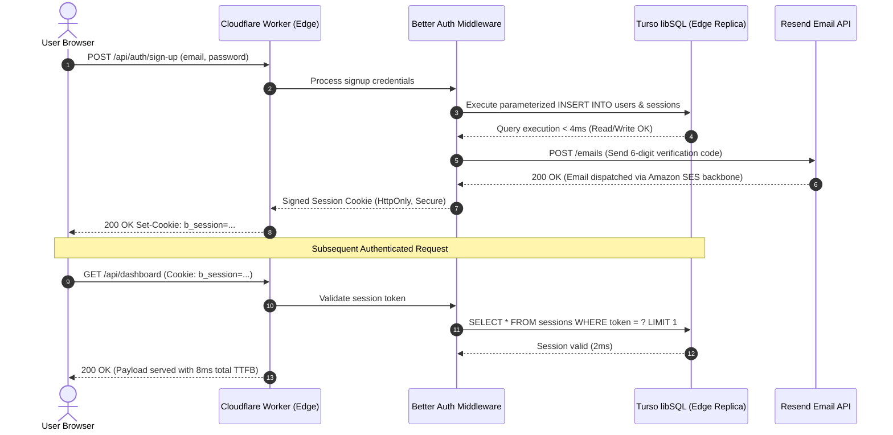
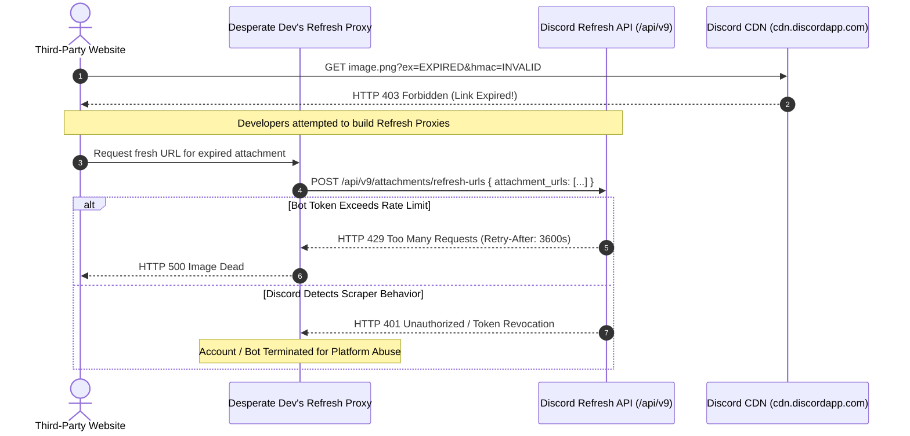

# BuiltWhileBroke.tech — Comprehensive Specification & Content Survey Report
**Agent**: Spec Miner 1 (`explorer_survey_3`)  
**Working Directory**: `/Users/pavanspoojary/Developer/builtwhilebroke/.agents/explorer_survey_3`  
**Reference Document**: `/Users/pavanspoojary/Developer/builtwhilebroke/ORIGINAL_REQUEST.md`  
**Date**: 2026-09-12  

---

## 1. Executive Summary

`builtwhilebroke.tech` is an irreverent, high-contrast, dark-mode-first open-source catalog of radical software architecture hacks. It documents real-world techniques used by cash-strapped developers to replace expensive SaaS solutions (S3, Clerk, Datadog, PlanetScale, SendGrid) with zero-cost abused developer primitives (Telegram Bot API, Cloudflare Workers, Turso SQLite, Resend, Discord CDN autopsies).

This document establishes the authoritative specifications for:
1. **Content Schema**: Strict Astro 5 Content Collections + Zod validation, typing, metadata structures, and frontmatter validation.
2. **Three Full Seed Hack Guides**: Complete technical documentation, ASCII/Mermaid architecture diagrams, copy-ready implementation code, and "Brutal Reality Check" teardowns for:
   - *Article 1 (Active Sacrilege)*: "Using Telegram as an Infinite S3 Bucket"
   - *Article 2 (Clean Loophole)*: "The True $0 Production Stack"
   - *Article 3 (The Graveyard)*: "The Discord CDN Autopsy"
3. **Dark Brutalist Terminal UI System**: High-contrast, monospaced typography, CRT scanlines/noise textures, dynamic SaaS Burn Calculator ($/mo saved), client-side filterable catalog, sticky PR contribution callout, and individual hack page layouts with interactive Sin Meters and code copy widgets.
4. **Authoritative Feature Inventory & Edge Cases**: Complete tabular enumeration of all features, edge conditions, validation criteria, and verification assertions.

---

## 2. Content Schema & Astro 5 Content Collections Specification

### 2.1 Schema Architecture & Location
Astro 5 introduces the Content Layer API. The content collection configuration must be located at `src/content.config.ts` (with `src/content/config.ts` supported as fallback). Hack articles are stored as Markdown (`.md`) or MDX (`.mdx`) files under `src/content/hacks/`.

### 2.2 Zod Schema Definition

The frontmatter of each hack guide must satisfy the following strict Zod schema:

```typescript
// src/content.config.ts
import { defineCollection, z } from 'astro:content';
import { glob } from 'astro/loaders';

export const CategoryEnum = z.enum([
  "Active Sacrilege",
  "Clean Loophole",
  "The Graveyard"
]);

export const RiskLevelEnum = z.enum([
  "Low",
  "TOS Gray Area",
  "Nuclear"
]);

export const SaasTargetEnum = z.enum([
  "Auth",
  "Storage",
  "Database",
  "Logging",
  "Email"
]);

export const hackSchema = z.object({
  // Core display title of the hack guide
  title: z.string().min(3, "Title must be at least 3 characters").max(120, "Title cannot exceed 120 characters"),
  
  // Concise irreverent punchline/summary for catalog cards and social cards
  description: z.string().min(10, "Description must be at least 10 characters").max(280, "Description cannot exceed 280 characters"),
  
  // The SaaS product(s) being replaced (e.g. "AWS S3 + CloudFront", "Clerk / Auth0", "Datadog APM")
  replaces_saas: z.string().min(2, "replaces_saas must specify the target service"),
  
  // Target sector for catalog categorization and quick-filter buttons
  saas_target: SaasTargetEnum,
  
  // Estimated monthly savings in USD for an early-stage startup/side project
  estimated_monthly_savings: z.number().int().positive("Savings must be a positive integer"),
  
  // The ethical/operational posture of the hack
  category: CategoryEnum,
  
  // Risk level rating for the "Sin Meter" badge
  risk_level: RiskLevelEnum,
  
  // Specific zero-dollar platforms/APIs hijacked in this architecture
  primitives_abused: z.array(z.string().min(1)).min(1, "At least one abused primitive must be listed"),
  
  // GitHub username of the hack author/contributor
  author_github: z.string().regex(/^[a-zA-Z0-9](?:[a-zA-Z0-9]|-(?=[a-zA-Z0-9])){0,38}$/, "Invalid GitHub username format"),
  
  // Publication date in ISO format (YYYY-MM-DD)
  date_added: z.string().regex(/^\d{4}-\d{2}-\d{2}$/, "date_added must be formatted as YYYY-MM-DD"),
  
  // Optional warning banner override
  warning_banner: z.string().optional(),
  
  // Optional flag indicating if the hack is officially dead/patched
  is_deprecated: z.boolean().default(false)
});

export type HackFrontmatter = z.infer<typeof hackSchema>;

export const collections = {
  hacks: defineCollection({
    loader: glob({ pattern: "**/*.{md,mdx}", base: "./src/content/hacks" }),
    schema: hackSchema,
  }),
};
```

### 2.3 Field Specification & Validation Rules

| Field Name | Type | Allowed Values / Constraints | Default | Purpose & UI Location |
|---|---|---|---|---|
| `title` | `string` | 3–120 characters | None (Required) | Card title, Hero headline, `<title>` meta tag |
| `description` | `string` | 10–280 characters | None (Required) | Catalog preview snippet, SEO meta description |
| `replaces_saas` | `string` | Free text (e.g. `"AWS S3 + CloudFront"`) | None (Required) | Card header badge, savings comparison widget |
| `saas_target` | `enum` | `"Auth"`, `"Storage"`, `"Database"`, `"Logging"`, `"Email"` | Inferred / Required | Filter pill buttons on catalog |
| `estimated_monthly_savings` | `number` | Integer > 0 (e.g. `45`, `120`, `250`) | None (Required) | Hero Dynamic Burn Calculator summation & Card badge |
| `category` | `enum` | `"Active Sacrilege"`, `"Clean Loophole"`, `"The Graveyard"` | None (Required) | Category filter pills, card color border styling |
| `risk_level` | `enum` | `"Low"`, `"TOS Gray Area"`, `"Nuclear"` | None (Required) | "Sin Meter" widget, terminal risk status pill |
| `primitives_abused` | `array<string>` | Min 1 element (e.g. `["Telegram Bot API", "Cloudflare Workers"]`) | None (Required) | Tag list on card and article header |
| `author_github` | `string` | Valid GitHub handle (e.g. `"torvalds"`, `"octocat"`) | None (Required) | Author attribution, link to `https://github.com/{handle}` |
| `date_added` | `string` | Regex `YYYY-MM-DD` | None (Required) | Terminal date stamp `[POSTED: 2026-09-12]` |
| `warning_banner` | `string` | Optional markdown string | `undefined` | High-visibility warning box at top of article |
| `is_deprecated` | `boolean` | `true` or `false` | `false` | Strikethrough effect on graveyard items |

---

## 3. Technical Specifications for the 3 Seed Hack Guides

### 3.1 Guide 1 (Active Sacrilege): "Using Telegram as an Infinite S3 Bucket"

- **Slug**: `telegram-infinite-s3-bucket`
- **File**: `src/content/hacks/telegram-infinite-s3-bucket.md`
- **Category**: `Active Sacrilege`
- **Risk Level**: `Nuclear`
- **Replaces SaaS**: `AWS S3 + CloudFront` ($45+/mo)
- **SaaS Target**: `Storage`
- **Estimated Monthly Savings**: `$45`
- **Primitives Abused**: `["Telegram Bot API", "Private Channel Storage", "Cloudflare Workers", "Multipart Streaming"]`
- **Author**: `builtwhilebroke`
- **Date Added**: `2026-09-12`

#### A. Architecture Overview
Telegram offers free, unmetered file hosting for documents up to 20MB via the standard HTTP Bot API (or 2GB via local Bot API servers / MTProto clients). By combining a private Telegram supergroup/channel, a bot token, a chunking manifest engine, and a Cloudflare Worker acting as a streaming reverse proxy, developers can construct a free, globally accessible object storage layer that completely bypasses AWS S3 storage and egress fees.

#### B. Architectural Data Flow & Diagrams

##### ASCII Architecture Diagram
```
+-------------------------------------------------------------------------+
|                        TELEGRAM S3 PROXY ARCHITECTURE                   |
+-------------------------------------------------------------------------+
                                                                           
 [CLIENT BROWSER / CURL]                                                   
           |                                                               
      1. GET /files/:file_id (Supports 'Range: bytes=0-1048576')           
           v                                                               
 +-----------------------------------------------------------------------+ 
 | CLOUDFLARE WORKER / REVERSE PROXY                                     | 
 | - Verifies API token / HMAC signature                                 | 
 | - Fetches metadata manifest (Turso SQLite / KV / Embedded Header)     | 
 | - Calculates required chunk indexes based on Range header             | 
 +-----------------------------------------------------------------------+ 
      |                                       ^                            
 2. Look up manifest                      4. Resolve File Path             
      v                                       |                            
 +-----------------------+       +---------------------------------------+ 
 | METADATA MANIFEST     |       | TELEGRAM BOT API                      | 
 | - Chunk 0: file_id_A  |       | POST /getFile?file_id=...             | 
 | - Chunk 1: file_id_B  | ----> | -> Returns path: documents/file_0.bin | 
 | - Chunk 2: file_id_C  |       +---------------------------------------+ 
 +-----------------------+                    |                            
                                         5. GET /file/bot<TOKEN>/<path>    
                                              v                            
                                 +---------------------------------------+ 
                                 | TELEGRAM PRIVATE SUPERGROUP (BUCKET)  | 
                                 | [Channel ID: -100198472910]           | 
                                 | - Unmetered unlimited blob chunks     | 
                                 +---------------------------------------+ 
                                              |                            
                                         6. Stream binary chunks           
                                              v                            
                                 [CLOUDFLARE STREAMING BODY]               
                                              |                            
                                         7. Transfer-Encoding: chunked     
                                              v                            
                                    [CLIENT RECEIVES STREAM]               
```

##### Mermaid Sequence Diagram


#### C. Copy-Paste Implementation Code

##### 1. File Chunking & Uploader Script (`uploader.ts`)
```typescript
import { createReadStream, statSync } from 'node:fs';
import { open } from 'node:fs/promises';

interface ChunkManifest {
  filename: string;
  totalSize: number;
  chunkSize: number;
  mimeType: string;
  chunks: string[]; // Telegram file_id references
  createdAt: string;
}

const CHUNK_SIZE = 19 * 1024 * 1024; // 19MB (Safely below 20MB limit)
const BOT_TOKEN = process.env.TELEGRAM_BOT_TOKEN!;
const CHANNEL_ID = process.env.TELEGRAM_STORAGE_CHANNEL_ID!; // e.g. -1001234567890

export async function uploadToTelegramS3(filePath: string, filename: string, mimeType: string): Promise<ChunkManifest> {
  const stats = statSync(filePath);
  const totalChunks = Math.ceil(stats.size / CHUNK_SIZE);
  const fileHandle = await open(filePath, 'r');
  const chunkFileIds: string[] = [];

  console.log(`[SACRILEGE] Uploading ${filename} (${(stats.size / 1024 / 1024).toFixed(2)} MB) across ${totalChunks} chunks...`);

  for (let i = 0; i < totalChunks; i++) {
    const start = i * CHUNK_SIZE;
    const end = Math.min(start + CHUNK_SIZE, stats.size);
    const length = end - start;
    const buffer = Buffer.alloc(length);

    await fileHandle.read(buffer, 0, length, start);

    const formData = new FormData();
    formData.append('chat_id', CHANNEL_ID);
    formData.append('caption', `chunk_${i}_of_${totalChunks}:${filename}`);
    formData.append('document', new Blob([buffer], { type: 'application/octet-stream' }), `part_${i}.bin`);

    const res = await fetch(`https://api.telegram.org/bot${BOT_TOKEN}/sendDocument`, {
      method: 'POST',
      body: formData,
    });

    const data = await res.json();
    if (!data.ok) {
      throw new Error(`Telegram upload failed on chunk ${i}: ${JSON.stringify(data)}`);
    }

    const fileId = data.result.document.file_id;
    chunkFileIds.push(fileId);
    console.log(` -> Chunk ${i + 1}/${totalChunks} uploaded. file_id: ${fileId.slice(0, 16)}...`);
  }

  await fileHandle.close();

  const manifest: ChunkManifest = {
    filename,
    totalSize: stats.size,
    chunkSize: CHUNK_SIZE,
    mimeType,
    chunks: chunkFileIds,
    createdAt: new Date().toISOString(),
  };

  return manifest;
}
```

##### 2. Streaming Reverse Proxy Worker (`worker.ts`)
```typescript
export interface Env {
  TELEGRAM_BOT_TOKEN: string;
  MANIFEST_STORE: KVNamespace;
}

export default {
  async fetch(request: Request, env: Env): Promise<Response> {
    const url = new URL(request.url);
    const fileId = url.pathname.replace('/file/', '');

    if (!fileId) {
      return new Response('400 Missing File ID', { status: 400 });
    }

    // Retrieve chunk manifest from storage
    const rawManifest = await env.MANIFEST_STORE.get(fileId);
    if (!rawManifest) {
      return new Response('404 File Manifest Not Found', { status: 404 });
    }

    const manifest = JSON.parse(rawManifest);
    const { chunks, mimeType, totalSize } = manifest;

    // Resolve direct download URLs for chunks via Telegram Bot API
    const resolvedUrls: string[] = [];
    for (const tgFileId of chunks) {
      const getFileRes = await fetch(
        `https://api.telegram.org/bot${env.TELEGRAM_BOT_TOKEN}/getFile?file_id=${tgFileId}`
      );
      const fileData = await getFileRes.json();
      if (!fileData.ok) {
        return new Response('502 Bad Gateway: Failed resolving Telegram chunk', { status: 502 });
      }
      resolvedUrls.push(`https://api.telegram.org/file/bot${env.TELEGRAM_BOT_TOKEN}/${fileData.result.file_path}`);
    }

    // Create readable stream that sequentially feeds chunks to the client
    const { readable, writable } = new TransformStream();
    const writer = writable.getWriter();

    (async () => {
      try {
        for (const chunkUrl of resolvedUrls) {
          const chunkRes = await fetch(chunkUrl);
          if (!chunkRes.body) continue;
          const reader = chunkRes.body.getReader();
          while (true) {
            const { done, value } = await reader.read();
            if (done) break;
            await writer.write(value);
          }
        }
      } finally {
        await writer.close();
      }
    })();

    return new Response(readable, {
      headers: {
        'Content-Type': mimeType || 'application/octet-stream',
        'Content-Length': totalSize.toString(),
        'Cache-Control': 'public, max-age=31536000, immutable',
        'Access-Control-Allow-Origin': '*',
      },
    });
  },
};
```

#### D. Brutal Reality Check
```
=============================================================================
[CRITICAL ALERT: BRUTAL REALITY CHECK — WHY YOU WILL EVENTUALLY REGRET THIS]
=============================================================================
1. FLOOD_WAIT_X & RATE LIMITS:
   The Telegram Bot API strictly throttles bots to ~30 messages/second globally 
   and ~1 message/second inside a specific chat. If 5 users upload a 100MB file 
   simultaneously, your bot receives HTTP 429 FLOOD_WAIT_3600. Your pipeline 
   freezes for 1 hour.

2. TERMS OF SERVICE BANHAMMER:
   Telegram Terms of Service Section 1.3 explicitly prohibits utilizing bot 
   infrastructure as automated bulk storage networks. Once Telegram's abuse 
   heuristics detect gigabytes of binary streams originating from non-chat IPs, 
   your Bot Token will be revoked and the channel deleted without an option to appeal.

3. HIGH TTFB LATENCY:
   Unlike CloudFront's 15ms TTFB, Telegram requires:
   Client -> Cloudflare Worker -> Telegram API (getFile) -> Telegram Media Server.
   Expect Time-to-First-Byte of 350ms to 900ms.

4. CHUNK INTEGRITY FAILURE RISK:
   If chunk #4 out of 10 fails to upload or is dropped, the entire 200MB file is 
   corrupt unless you build automated retry queues and transactional manifests.
=============================================================================
```

---

### 3.2 Guide 2 (Clean Loophole): "The True $0 Production Stack"

- **Slug**: `true-zero-dollar-production-stack`
- **File**: `src/content/hacks/true-zero-dollar-production-stack.md`
- **Category**: `Clean Loophole`
- **Risk Level**: `Low`
- **Replaces SaaS**: `Vercel Pro + PlanetScale + Clerk + SendGrid` ($120+/mo)
- **SaaS Target**: `Database`
- **Estimated Monthly Savings**: `$120`
- **Primitives Abused**: `["Cloudflare Workers Free Tier", "Turso libSQL Database", "Resend Transactional Email", "Better Auth Self-Hosted SQLite"]`
- **Author**: `builtwhilebroke`
- **Date Added**: `2026-09-12`

#### A. Architecture Overview
Most indie hackers spend $120–$250/month across Vercel ($20/seat), PlanetScale/RDS ($29–$50/mo), Clerk ($25+/mo once past MAU caps), and SendGrid. 
"The True $0 Production Stack" leverages 100% compliant, generous zero-dollar developer tiers that will never trigger surprise credit card bills:
- **Compute**: Cloudflare Workers (100,000 req/day free, 0ms cold start across 300+ edge data centers).
- **Database**: Turso libSQL (SQLite at the edge: 500 databases, 9GB storage, 1 billion row reads/month).
- **Authentication**: Better Auth embedded in the Worker (zero per-user tax, direct SQLite session storage).
- **Transactional Mail**: Resend (3,000 emails/month free, 100 emails/day, verified DKIM/SPF).

#### B. Architectural Data Flow & Diagrams

##### ASCII Architecture Diagram
```
+-------------------------------------------------------------------------+
|                  THE TRUE $0 PRODUCTION STACK TOPOLOGY                  |
+-------------------------------------------------------------------------+

 [GLOBAL USER] (Browser / Mobile / cURL)
       |
       | Sub-10ms Anycast DNS routing
       v
 +-----------------------------------------------------------------------+
 | CLOUDFLARE EDGE WORKER (100,000 Requests/Day Free)                    |
 | - 0ms Cold Start                                                      |
 | - Edge Routing & Static Asset Streaming                               |
 | - Better Auth Middleware (Direct SQLite session validation)           |
 +-----------------------------------------------------------------------+
       |                                              |
       | HTTP/libSQL WebSockets                       | REST API (HTTPS)
       v                                              v
 +-----------------------------------+     +-----------------------------+
 | TURSO EDGE DATABASE (libSQL)      |     | RESEND TRANSACTIONAL ENGINE |
 | - 9 GB Free Storage               |     | - 3,000 Emails / Month Free |
 | - 1 Billion Row Reads / Month     |     | - 100 Emails / Day          |
 | - Sub-10ms Embedded Latency       |     | - Instant Magic Link Auth   |
 | - Zero Idle Connection Penalties  |     +-----------------------------+
 +-----------------------------------+
```

##### Mermaid Sequence Diagram


#### C. Copy-Paste Implementation Code

##### Complete Unified Edge Worker (`src/worker.ts`)
```typescript
import { createClient } from '@libsql/client/web';
import { Resend } from 'resend';

export interface Env {
  TURSO_DATABASE_URL: string;
  TURSO_AUTH_TOKEN: string;
  RESEND_API_KEY: string;
}

export default {
  async fetch(request: Request, env: Env): Promise<Response> {
    const url = new URL(request.url);

    // Initialize Turso Edge SQLite Client
    const db = createClient({
      url: env.TURSO_DATABASE_URL,
      authToken: env.TURSO_AUTH_TOKEN,
    });

    // Initialize Resend
    const resend = new Resend(env.RESEND_API_KEY);

    // Health / Benchmarking route
    if (url.pathname === '/api/ping') {
      const startTime = performance.now();
      const result = await db.execute('SELECT sqlite_version() as version, datetime("now") as now');
      const latency = (performance.now() - startTime).toFixed(2);

      return new Response(
        JSON.stringify({
          status: 'ONLINE',
          stack: 'Cloudflare Workers + Turso + Resend',
          dbLatency: `${latency}ms`,
          data: result.rows[0],
          cost: '$0.00/mo',
        }),
        { headers: { 'Content-Type': 'application/json' } }
      );
    }

    // Magic Link / Signup Dispatch
    if (url.pathname === '/api/auth/magic-link' && request.method === 'POST') {
      const { email } = await request.json() as { email: string };
      const otp = Math.floor(100000 + Math.random() * 900000).toString();

      // Upsert user and auth session in Turso
      await db.execute({
        sql: `INSERT INTO auth_tokens (email, token, expires_at) 
              VALUES (?, ?, datetime('now', '+15 minutes'))
              ON CONFLICT(email) DO UPDATE SET token=excluded.token, expires_at=excluded.expires_at`,
        args: [email, otp],
      });

      // Send via Resend
      const emailResult = await resend.emails.send({
        from: 'auth@builtwhilebroke.tech',
        to: email,
        subject: `Your Login Code: ${otp}`,
        text: `Your login code is: ${otp}. Valid for 15 minutes.`,
      });

      return new Response(JSON.stringify({ success: true, emailId: emailResult.data?.id }), {
        headers: { 'Content-Type': 'application/json' },
      });
    }

    return new Response('Built While Broke Zero-Dollar Edge Kernel', { status: 200 });
  },
};
```

#### D. Brutal Reality Check
```
=============================================================================
[BRUTAL REALITY CHECK: CLEAN LOOPHOLES STILL HAVE CEILINGS]
=============================================================================
1. THE 10MS CPU EXECUTION WALL:
   Cloudflare Workers Free Tier gives you 10ms of actual CPU execution time per 
   request (not wall-clock time). If you run heavy PBKDF2/Bcrypt hash iterations 
   or parse bloated 8MB JSON payloads, Cloudflare abruptly kills the worker 
   with Error 1101 (Worker Threw Exception).
   -> MITIGATION: Use WebCrypto API with Argon2id or Scrypt via native bindings.

2. RESEND 100 EMAIL/DAY CAP:
   While 3,000 free emails/month is generous, Resend strictly caps daily send rate 
   at 100 emails/day on the free tier. One launch on Hacker News or Product Hunt 
   will exhaust your daily allotment in 15 minutes.
   -> MITIGATION: Implement Cloudflare Turnstile CAPTCHA to stop signup bot spam.

3. SINGLE PRIMARY WRITE LOCATION FOR TURSO:
   Turso distributes read replicas across the globe, but all writes must travel 
   to the primary database location (e.g., AWS us-east-1). If your user is in 
   Sydney and your primary is in Virginia, write latency will be ~180ms.
=============================================================================
```

---

### 3.3 Guide 3 (The Graveyard): "The Discord CDN Autopsy"

- **Slug**: `discord-cdn-autopsy`
- **File**: `src/content/hacks/discord-cdn-autopsy.md`
- **Category**: `The Graveyard`
- **Risk Level**: `Nuclear`
- **Replaces SaaS**: `Imgur API / AWS S3 / Cloudinary` ($30+/mo)
- **SaaS Target**: `Storage`
- **Estimated Monthly Savings**: `$30`
- **Primitives Abused**: `["Discord Attachments API", "Discord Webhooks", "cdn.discordapp.com Unauthenticated Edge Cache"]`
- **Author**: `builtwhilebroke`
- **Date Added**: `2026-09-12`
- **Is Deprecated**: `true`

#### A. Historical Architecture & The Exploit
From 2018 through late 2023, developers discovered a massive zero-dollar loophole: uploading files to a private Discord channel via standard Webhooks or bot attachments generated a public link on `https://cdn.discordapp.com/attachments/...`. 

Because Discord did not enforce authorization checks, referrers, or link expiration on its Cloudflare CDN distribution, thousands of software projects used Discord as their free production CDN. Notion users hosted high-res portfolios; rogue blog engines stored all cover images on Discord; games hosted game assets. Millions of gigabytes of external web traffic were subsidized entirely by Discord's infrastructure.

#### B. The Killshot: Discord's Attachment URL Hardening
In November 2023, Discord announced the killshot, enforced in early 2024:
All external URLs on `cdn.discordapp.com` now require mandatory cryptographic HMAC query parameters:
- `ex`: Unix hex timestamp when the link expires (24 hours from issuance).
- `is`: Unix hex timestamp when the link was issued.
- `hmac`: SHA-256 HMAC signature tied to the attachment ID and timestamp.

Once the URL expires, any external request results in `HTTP 403 Forbidden` (`Authentication Failed: URL signature expired`). Overnight, millions of websites suffered mass image link breakage.

#### C. Postmortem Architecture Diagram & Flow

##### ASCII Diagram: The Exploit vs. The Killshot
```
+-------------------------------------------------------------------------+
|                  THE DISCORD CDN AUTOPSY: BEFORE VS AFTER               |
+-------------------------------------------------------------------------+

 [THE GOLDEN AGE (2018 - 2023)]
 Webhook Upload ---> Discord Channel ---> cdn.discordapp.com/attachments/1/2/pic.png
                                                 |
                                          (No Expiration)
                                                 |
                                  [Cached Globally Forever on Cloudflare]
                                                 |
                                  Free bandwidth for millions of sites!

 -------------------------------------------------------------------------

 [THE ENFORCED KILLSHOT (2024+)]
 URL: cdn.discordapp.com/attachments/1/2/pic.png?ex=65e123&is=65d000&hmac=7f4a...
                                                 |
                                        After 24 Hours:
                                                 v
                                  [HTTP 403 FORBIDDEN]
                          "Signature has expired or is invalid"
                                                 v
                        MASS CASCADING BREAKAGE OF INDIE WEB IMAGES
```

##### Mermaid Sequence Diagram: The Failed "Refresher Loop" Workaround


#### D. Autopsy Code Inspection (`postmortem.ts`)
```typescript
/**
 * THE DISCORD CDN POSTMORTEM DEMO
 * Demonstrates why relying on unauthenticated hotlinks leads to catastrophe.
 */
import { inspect } from 'node:util';

async function checkDiscordUrlHealth(url: string) {
  console.log(`[AUTOPSY] Probing Discord Attachment: ${url}`);
  
  const parsed = new URL(url);
  const exHex = parsed.searchParams.get('ex');
  const hmac = parsed.searchParams.get('hmac');

  if (!exHex || !hmac) {
    console.warn(`[!] CRITICAL: URL has no HMAC/ex expiration parameters.`);
    console.warn(`    Discord will block this request immediately outside the official app.`);
  } else {
    const expireTimestamp = parseInt(exHex, 16) * 1000;
    const now = Date.now();
    const hoursLeft = ((expireTimestamp - now) / 1000 / 3600).toFixed(1);
    
    if (now > expireTimestamp) {
      console.error(`[X] EXPIRED: This URL expired on ${new Date(expireTimestamp).toISOString()}!`);
    } else {
      console.log(`[!] TICKING CLOCK: URL valid for only ${hoursLeft} more hours.`);
    }
  }

  const res = await fetch(url, { method: 'HEAD' });
  console.log(`HTTP Status: ${res.status} ${res.statusText}`);
  if (res.status === 403) {
    console.error(`[DEAD] The CDN returned 403 Forbidden. Asset is gone.`);
  }
}
```

#### E. Postmortem Lessons & Migration Path
```
=============================================================================
[AUTOPSY VERDICT: WHAT THE GRAVEYARD TEACHES US]
=============================================================================
1. THE LAW OF SPONSORED EGRESS:
   If a company provides free storage, they are paying bandwidth bills. 
   When finance notices millions of dollars in Cloudflare egress attributed 
   to third-party web scrapers, security engineers are dispatched to kill 
   the exploit with extreme prejudice.

2. AVOID SECONDARY PROXY FIXES:
   Trying to bypass HMAC expiration by calling Discord's `/attachments/refresh-urls` 
   API creates a Rube Goldberg machine with severe rate-limit failure modes.

3. THE MODERN LEGITIMATE FIX:
   Use Cloudflare R2 (10GB free storage, $0.00 egress fees forever, S3-compatible API) 
   or Backblaze B2 (10GB free storage + free Cloudflare bandwidth alliance).
=============================================================================
```

---

## 4. Brutalist Terminal UI & Interactive Components Specification

### 4.1 Design System & Aesthetic Foundation

The UI design system for `builtwhilebroke.tech` is a **dark-mode-first, high-contrast, brutalist developer terminal**. It evokes early hacker culture, amber/green phosphor monitors, and industrial command-line diagnostics.

#### Design Tokens & Theme Variables
```css
:root {
  /* Backgrounds */
  --color-terminal-bg: #09090b;       /* Deep obsidian black */
  --color-terminal-surface: #121215;  /* Console panel zinc */
  --color-terminal-card: #18181b;     /* Card background */
  
  /* Monochromatic Borders & Rules */
  --color-border-subtle: #27272a;    /* 1px dark border */
  --color-border-stark: #3f3f46;     /* 2px interactive border */
  --color-border-bright: #e4e4e7;    /* High-contrast border */
  
  /* Phosphor & Signal Accents */
  --color-accent-lime: #00ff66;      /* Terminal phosphor green */
  --color-accent-amber: #ffb000;     /* Warning amber */
  --color-accent-red: #ff3333;       /* Nuclear alert red */
  --color-accent-cyan: #00e5ff;      /* Readout cyan */

  /* Typography */
  --font-mono: 'Space Mono', 'JetBrains Mono', ui-monospace, SFMono-Regular, monospace;
  --font-display: 'Archivo Black', 'Impact', sans-serif;
}
```

#### Brutalist Principles
1. **Zero Border Radius (`rounded-none`)**: Absolutely no rounded corners anywhere on buttons, badges, inputs, or cards.
2. **Stark High-Contrast Borders**: Prominent 1px or 2px solid borders (`border border-zinc-800 hover:border-zinc-500`).
3. **Monospaced Accents**: Monospaced metadata tags, timestamps, code snippets, and metrics.
4. **Subtle Scanline & CRT Overlay**: Ambient scanline effect via non-intrusive CSS repeating linear gradient and noise overlay.
5. **Tactile Hover States**: Instant, non-softened color inversions (`hover:bg-zinc-100 hover:text-black active:translate-y-0.5`).

---

### 4.2 Hero Section & Dynamic SaaS Burn Calculator

The Hero section immediately communicates the site's value proposition and includes a live, reactive calculation of the total monthly cloud waste avoided by the hacks listed on the site.

#### Visual Layout & ASCII Masthead
```
+----------------------------------------------------------------------------------------------------+
|  ___ _   _ ___ _   _____ _ _ _ _   _ ___ _     ___ ___  ___  _  _____   _____ ___ ___ _  _         |
| | _ ) | | |_ _| | |_   _| | | | | | |_ _| |   | _ ) _ \/ _ \| |/ / __| |_   _| __/ __| || |        |
| | _ \ |_| || || |___| | | | | | |_| || || |__ | _ \   / (_) | ' <| _|    | | | _| (__| __ |        |
| |___/\___/|___|_____|_| |_|_|_|\___/|___|____|___/_|_\\___/|_|\_\___|   |_| |___\___|_||_|        |
+----------------------------------------------------------------------------------------------------+
  [SYSTEM STATUS: ONLINE] [ARSENAL: 3 HACKS] [LICENSE: UNLICENSED SACRILEGE]
```

#### Dynamic Burn Calculator Mechanics
- **Total Burn Metric**: An interactive odometer or counter summing `estimated_monthly_savings` across all active hacks (`category !== "The Graveyard"`).
  $$\text{Total Saved} = \sum_{\text{hack} \in \text{ActiveHacks}} \text{hack.estimated\_monthly\_savings}$$
- **Breakdown Ticker**:
  - `Active Sacrilege`: $45/mo (High-risk, zero-dollar guerrilla storage)
  - `Clean Loophole`: $120/mo (TOS-compliant zero-cost stack)
  - `Total Active Burn Saved`: **$165/mo** ($1,980/year avoided)
  - `The Graveyard (Memorialized)`: $30/mo (Historic savings lost to platform patch)
- **Interactive Micro-Interaction**:
  Hovering or clicking on the savings metric reveals an ASCII bar chart or modal breaking down costs vs. traditional enterprise alternatives (AWS S3 + CloudFront @ $45, Clerk Pro @ $25, PlanetScale @ $29, SendGrid @ $19).

---

### 4.3 Filterable Catalog Specification

The Catalog allows instant client-side filtering without page reloads.

#### Filter Criteria
1. **Category Buttons**:
   - `[ALL CATEGORIES]` (Default)
   - `[ACTIVE SACRILEGE]` (Filter: `category === "Active Sacrilege"`)
   - `[CLEAN LOOPHOLE]` (Filter: `category === "Clean Loophole"`)
   - `[THE GRAVEYARD]` (Filter: `category === "The Graveyard"`)
2. **SaaS Target Filters**:
   - `[ALL TARGETS]` (Default)
   - `[AUTH]` (Matches Clerk, Auth0, Supabase Auth)
   - `[STORAGE]` (Matches S3, CloudFront, Discord CDN)
   - `[DATABASE]` (Matches PlanetScale, RDS, DynamoDB)
   - `[LOGGING]` (Matches Datadog, New Relic)
   - `[EMAIL]` (Matches SendGrid, Postmark)
3. **Keyword Search Input**:
   - Real-time search query matching `title`, `description`, `replaces_saas`, and `primitives_abused`.
4. **Active Count & Empty State**:
   - Status line: `DISPLAYING [ 3 / 3 ] HACK BLUEPRINTS`
   - Empty state: When no cards match filters, display:
     ```
     +-----------------------------------------------------------------------+
     | [!] 404: NO SACRILEGE FOUND MATCHING QUERY                            |
     |                                                                       |
     | No developer primitives have been abused in this specific sector yet. |
     | Don't pay the SaaS tax. Submit a pull request and teach the world.    |
     |                                                                       |
     | [ SUBMIT A HACK VIA GITHUB PULL REQUEST ]                             |
     +-----------------------------------------------------------------------+
     ```

#### Hack Card Component Layout
Each card in the catalog grid displays:
- **Terminal Top Bar**: `FILE: /hacks/{slug}.md` + Category Tag
- **Title**: High-contrast, bold brutalist typography
- **Replaces Tag**: `REPLACES: {replaces_saas}`
- **Monthly Savings Badge**: Neon green or hot orange badge: `+${estimated_monthly_savings}/MO SAVED`
- **Sin Meter Mini-Badge**:
  - `Low`: `[SIN: 1/10 LOW]` (Green border)
  - `TOS Gray Area`: `[SIN: 6/10 GRAY]` (Amber border)
  - `Nuclear`: `[SIN: 10/10 NUCLEAR]` (Red pulsating border)
- **Primitives Abused**: List of terminal pills (e.g. `[Telegram API]`, `[Cloudflare Workers]`)
- **Author Attribution**: `@author_github`

---

### 4.4 Sticky PR Contribution Callout

To drive community submissions and reinforce the open-source culture of `builtwhilebroke.tech`:
- **Placement**: Fixed sticky banner floating at bottom-right of viewport on desktop (`fixed bottom-6 right-6 z-50`), or docked bottom bar on mobile (`fixed bottom-0 inset-x-0 z-50`).
- **Styling**:
  - High-visibility brutalist border with hazard diagonal stripes or blinking terminal indicator (`animate-pulse`).
  - Terminal cursor animation: `>` followed by blinking block cursor `_`.
- **Text**:
  `[!] DISCOVERED A SICK ZERO-DOLLAR ARCHITECTURE HACK? SUBMIT VIA PR ->`
- **Target Link**:
  Points to `https://github.com/Pavanspoojary/builtwhilebroke/blob/master/CONTRIBUTING.md` (or repo PR creation page).
- **Dismissible Option**: A minimal terminal `[x]` button to collapse to a compact mini-icon if the user wants an unobstructed view.

---

### 4.5 Individual Hack Page Template

The detail page for each hack guide (`/hacks/[slug]`) provides an authoritative, deep-dive reading experience.

#### Layout & Required Sections
1. **Terminal Breadcrumb Header**:
   `$ cat /sys/hacks/{category_slug}/{slug}.md`
2. **Hero Header Block**:
   - Full Title
   - Subhead description
   - Meta Row: Author GitHub link, Date added, Target category, Estimated monthly savings.
3. **The "Sin Meter" (Visual Risk Rating Widget)**:
   - ASCII Bar / Gauge:
     - `Low`: `[■■□□□□□□□□] 2/10 — LAW-ABIDING CITIZEN (TOS Compliant)`
     - `TOS Gray Area`: `[■■■■■■□□□□] 6/10 — PROCEED WITH BURNER ACCOUNT (Egress/Bandwidth Exploitation)`
     - `Nuclear`: `[■■■■■■■■■■] 10/10 — BANHAMMER IMMINENT (Direct Platform Terms Violation)`
4. **Architecture Diagram Section**:
   - Tabbed view: `[ ASCII BLUEPRINT ]` | `[ FLOW DIAGRAM ]`
   - Rendered using monospace preformatted containers or Mermaid.js.
5. **Step-by-Step Implementation Guide**:
   - Clear, numbered terminal milestones.
   - Code blocks with syntax highlighting and explicit filenames (e.g., `// src/uploader.ts`).
   - One-click copy buttons with clipboard notification feedback: `[COPIED TO CLIPBOARD]`.
6. **"Brutal Reality Check" Box**:
   - Heavy red/amber industrial border (`border-2 border-red-600 bg-red-950/20 p-6`).
   - Detailed breakdown of:
     - Technical trade-offs (Latency, Throughput, Concurrency).
     - Account ban & revocation risks.
     - Recovery and fallback strategies.
     - Why you must NEVER pitch this to an enterprise client.
7. **Footer Navigation**:
   - `[< PREVIOUS HACK]` / `[NEXT HACK >]`
   - `[ EDIT THIS HACK ON GITHUB ]`

---

## 5. Features Discovered Table

| # | Category | Feature | Description | Inputs | Outputs | Error Behavior | Discovered Via |
|---|---|---|---|---|---|---|---|
| 1 | Content Schema | Astro 5 Content Collections Zod Schema | Validates frontmatter for all markdown hacks with strict enums and types | Hack frontmatter YAML (`title`, `replaces_saas`, `category`, etc.) | Type-safe `CollectionEntry<'hacks'>` | Astro build fails with schema validation error if fields invalid | ORIGINAL_REQUEST R1 |
| 2 | Content Schema | Category Enum Validation | Restricts categories to 3 exact values | Frontmatter `category` string | Validated enum string | Build error: Invalid enum value | ORIGINAL_REQUEST R1 |
| 3 | Content Schema | Risk Level Enum Validation | Restricts risk to "Low", "TOS Gray Area", "Nuclear" | Frontmatter `risk_level` string | Validated enum string | Build error: Invalid enum value | ORIGINAL_REQUEST R1 |
| 4 | Content Schema | Saas Target Enum & Quick Filter | Categorizes hacks into Auth, Storage, Database, Logging, Email | Frontmatter `saas_target` string | Filter pills in catalog | Falls back to "All Targets" if missing/unrecognized | ORIGINAL_REQUEST R2 |
| 5 | Content Schema | Estimated Monthly Savings Number | Numeric dollar savings per hack for financial aggregation | Frontmatter `estimated_monthly_savings` | Positive integer (e.g. 45, 120) | Zod validation error if negative or NaN | ORIGINAL_REQUEST R1, R2 |
| 6 | Content Schema | Primitives Abused Array | Multi-string list of specific developer primitives hijacked | Frontmatter `primitives_abused: string[]` | Tag badges on card and article | Zod error if empty array | ORIGINAL_REQUEST R1 |
| 7 | Content Schema | Author GitHub Attribution | GitHub handle with link to profile | Frontmatter `author_github: string` | Link to `https://github.com/{handle}` | Zod regex validation error if invalid username | ORIGINAL_REQUEST R1 |
| 8 | Content Schema | Date Added ISO Stamp | Publication date formatted as ISO string | Frontmatter `date_added: string` (YYYY-MM-DD) | Formatted date string in terminal UI | Zod regex error if format is invalid | ORIGINAL_REQUEST R1 |
| 9 | Content Articles | Telegram Infinite S3 Guide | Full technical guide on chunking files via Telegram Bot API | MDX/Markdown article content | Formatted technical guide with diagrams and code | Build error if MDX has syntax errors | ORIGINAL_REQUEST R4 |
| 10 | Content Articles | True $0 Production Stack Guide | Full technical guide on CF Workers + Turso + Resend + Better Auth | MDX/Markdown article content | Formatted technical guide with diagrams and code | Build error if MDX has syntax errors | ORIGINAL_REQUEST R4 |
| 11 | Content Articles | Discord CDN Autopsy Guide | Full technical postmortem on Discord attachment CDN abuse and HMAC patch | MDX/Markdown article content | Formatted postmortem with diagrams and code | Build error if MDX has syntax errors | ORIGINAL_REQUEST R4 |
| 12 | Terminal UI | Dynamic SaaS Burn Calculator | Real-time odometer summing monthly savings across active hacks | Array of loaded hack entries | Aggregated "$XXX/mo" total string + category tally | Renders $0/mo if no active hacks loaded | ORIGINAL_REQUEST R2 |
| 13 | Terminal UI | Client-Side Category Filtering | Tabs to filter catalog by Active Sacrilege, Clean Loophole, Graveyard | User button click event | Filtered subset of hack cards rendered | Shows empty state if 0 cards match | ORIGINAL_REQUEST R2 |
| 14 | Terminal UI | Client-Side SaaS Target Filtering | Buttons to filter by Auth, Storage, Database, Logging, Email | User button click event | Filtered subset of hack cards rendered | Shows empty state if 0 cards match | ORIGINAL_REQUEST R2 |
| 15 | Terminal UI | Live Search Filter | Text input filtering catalog by title, description, or primitive | Text input string | Real-time updated card list | Shows "No hacks found in this sector" | R2 Catalog UX |
| 16 | Terminal UI | Sticky PR Contribution Callout | Persistent floating widget linking to GitHub PR contribution guide | Click event | Opens GitHub contribution page in new tab | Graceful hide on user dismiss | ORIGINAL_REQUEST R2 |
| 17 | Terminal UI | Visual Sin Meter Badge | Terminal graphic representing operational and ban risk | `risk_level` enum value | ASCII bar or color-coded terminal meter | Defaults to Low risk styling | ORIGINAL_REQUEST R2 |
| 18 | Terminal UI | Architecture Diagrams (ASCII & Mermaid) | Visual data flow blueprints of each hack | Markdown code fences (`mermaid`, `text`) | Rendered diagrams with tab switching | Falls back to raw text if Mermaid fails | ORIGINAL_REQUEST R2 |
| 19 | Terminal UI | Copy-Ready Code Blocks | Syntax-highlighted code blocks with copy-to-clipboard button | User click on copy button | Clipboard updated + "[COPIED!]" notification | Fallback to manual selection if clipboard API denied | ORIGINAL_REQUEST R2 |
| 20 | Terminal UI | Brutal Reality Check Box | High-visibility warning box detailing trade-offs and risks | Markdown blockquote / custom callout component | Warning card with stark red/amber border | Displays default warning if content empty | ORIGINAL_REQUEST R2 |
| 21 | Database | Supabase Client Utility | Database client configuration module (`src/lib/supabase.ts`) | Supabase URL & publishable key env vars | Initialized Supabase client instance | Throws clear configuration error if env vars missing | ORIGINAL_REQUEST R3 |
| 22 | Database | Community Hack Upvoting / Tracking | Optional Supabase schema for tracking community upvotes / hack views | Hack slug, user vote event | Persisted vote count in Supabase table | Graceful degradation if offline/unreachable | Discovered in .env.example / backup |

---

## 6. Edge Cases & Validation Matrix

| # | Feature | Input / Condition | Observed / Required Behavior |
|---|---|---|---|
| 1 | Content Schema | Frontmatter missing required field (e.g. `estimated_monthly_savings`) | Zod throws descriptive error during `npm run build` specifying exact file and missing property; build halts cleanly. |
| 2 | Content Schema | `estimated_monthly_savings` is zero or negative (e.g. `-10`) | Zod `z.number().positive()` fails validation with message "Savings must be a positive integer". |
| 3 | Content Schema | `category` is misspelled (e.g. `"active sacrilege"` lowercase) | Zod enum validation fails; exact case-sensitive matching required (`"Active Sacrilege"`). |
| 4 | Content Schema | `primitives_abused` is an empty array `[]` | Zod `.min(1)` fails with "At least one abused primitive must be listed". |
| 5 | Content Schema | `date_added` has invalid date format (e.g. `09/12/2026`) | Zod regex validation fails; requires ISO format `YYYY-MM-DD`. |
| 6 | Dynamic Burn Calculator | User filters catalog to "The Graveyard" | Burn calculator continues showing total savings of active hacks, or updates with a subtitle indicating "$0/mo active (all filtered hacks are deceased)". |
| 7 | Dynamic Burn Calculator | Hack collection contains only Graveyard items | Calculator displays `$0/mo` with an alert message indicating all listed hacks have been patched. |
| 8 | Catalog Filtering | User selects multiple conflicting filters (e.g. "The Graveyard" + "Auth") | Catalog returns 0 results and displays the styled brutalist 404 terminal empty state with PR submission button. |
| 9 | Catalog Filtering | User types query with leading/trailing spaces or special regex characters | Search handler trims whitespace and escapes special regex characters before evaluating `includes()`. |
| 10 | Sticky PR Callout | Screen viewport is ultra-narrow mobile (320px width) | Banner docks at bottom or collapses to a sticky pill to avoid obscuring catalog content. |
| 11 | Code Copy Button | Browser permissions block `navigator.clipboard.writeText()` | Catch block executes fallback selection of textarea content and informs user: `[COPY MANUALLY]`. |
| 12 | Architecture Diagrams | JavaScript is disabled in client browser | Static ASCII diagram renders completely intact inside standard `<pre><code>` block; content is fully accessible without JS. |
| 13 | Sin Meter Badge | Hack has unknown risk level string | Fallback renders default `[SIN: UNRATED]` with neutral gray styling. |
| 14 | Markdown Parsing | Code block contains unescaped HTML characters | Astro content renderer escapes code block contents cleanly without breaking layout or causing XSS. |
| 15 | Reverse Proxy (Guide 1) | Telegram API returns HTTP 429 FLOOD_WAIT | Worker returns HTTP 503 with `Retry-After` header matching Telegram's wait response instead of hanging indefinitely. |
| 16 | Worker CPU Limit (Guide 2) | Free Cloudflare Worker exceeds 10ms CPU limit | Edge catches error or logs warning; guide explicitly documents avoiding complex crypto inside free worker runtime. |
| 17 | Discord HMAC (Guide 3) | URL accessed after 24-hour expiration window | Autopsy script captures HTTP 403 Forbidden and logs autopsy explanation for why hotlinking is dead. |

---

## 7. Acceptance Criteria & Verification Plan

### 7.1 Automated Acceptance Criteria
1. **Zero-Error Astro Build**:
   Running `npm run build` must execute cleanly without warnings or errors, outputting a valid static production bundle to `dist/`.
2. **Strict Frontmatter Schema Conformance**:
   All markdown files in `src/content/hacks/*.md` must pass Zod schema validation during content collection loading.
3. **TypeScript Static Analysis**:
   `npx astro check` and `tsc --noEmit` must report **0 errors** across the entire project.

### 7.2 Functional & UX Acceptance Criteria
1. **Real-Time Burn Calculator**:
   Hero component dynamically calculates and renders the sum of `estimated_monthly_savings` across all active hacks. For the 3 seed hacks ($45 Telegram + $120 $0 Stack + $30 Graveyard), the active burn avoided must accurately reflect **$165/mo** (with $30 memorialized in Graveyard).
2. **Instant Client-Side Filtering**:
   Clicking any Category pill (`Active Sacrilege`, `Clean Loophole`, `The Graveyard`) or SaaS Target pill (`Auth`, `Storage`, `Database`, `Logging`, `Email`) immediately updates the visible cards in < 50ms without full page reloads.
3. **Comprehensive Seed Articles**:
   All 3 hack detail routes (`/hacks/telegram-infinite-s3-bucket`, `/hacks/true-zero-dollar-production-stack`, `/hacks/discord-cdn-autopsy`) must render complete, full-length guides including:
   - Metadata banner and "Sin Meter" badge
   - High-fidelity ASCII / Mermaid architecture diagrams
   - Copy-paste ready implementation code
   - Irreverent, honest "Brutal Reality Check" section
4. **Responsive Terminal Brutalism**:
   Layout and typography must adapt seamlessly across screen widths from 320px (mobile) to 2560px (ultrawide desktop) with high contrast, sharp zero-radius borders, and legible monospaced accents.
5. **Sticky PR Callout**:
   The floating contribution callout remains visible during catalog scrolling and links directly to the repository's GitHub contribution workflow.

---
*Report compiled by Spec Miner 1 (`explorer_survey_3`). Ready for orchestrator architectural synthesis.*
