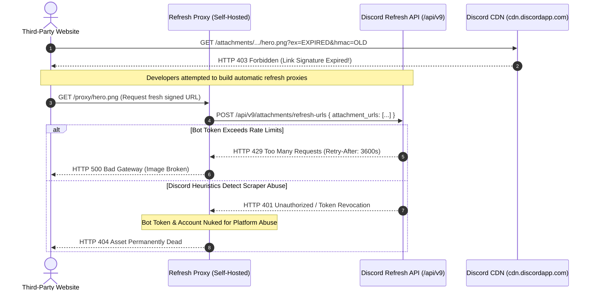

## The Golden Era of Parasitic Infrastructure

Between roughly 2018 and late 2023, the indie developer community shared an open secret: **Discord was accidentally operating the fastest, most reliable, completely unmetered public Content Delivery Network in human history.**

It began with a simple architectural observation. When you sent an image, video, or PDF to a private Discord channel via a simple Discord webhook or bot token, Discord's backend saved the attachment and returned a public URL with this structure:

```
https://cdn.discordapp.com/attachments/<channel_id>/<message_id>/<filename>
```

Here was the loophole: **Discord did not enforce authorization on that URL.** There were no bearer tokens, no signed cookies, no CORS restrictions, and no referer checks. Discord placed Cloudflare's enterprise CDN in front of `cdn.discordapp.com` to cache media files globally so chat users could scroll through memes with sub-second latency.

The consequence? Any file uploaded to a Discord channel became permanently accessible to anyone on the public internet, served from Cloudflare edge caches worldwide, with 100% uptime, zero authentication, and **$0.00 bandwidth costs to the uploader**.

---

## How the Web Abused Discord as a Free CDN

For half a decade, thousands of software projects turned Discord into their primary object store:
- **Notion & Obsidian Power Users:** Hosted high-resolution cover photos and embedded PDFs in private Discord channels to avoid workspace storage caps.
- **Bootstrapped Startup Blogs:** Stored every hero image and technical diagram on Discord attachments, bypassing AWS S3 + CloudFront bills entirely ($30–$80/month saved).
- **Indie Mobile Games:** Downloaded character sprites and level audio packs from Discord attachment URLs at runtime.
- **Piracy & Torrent Indices:** Mirrored terabytes of binaries and ROMs across thousands of throwaway Discord burner servers.

Millions of gigabytes of external web traffic were being quietly subsidized by Discord's venture capital reserves. Every time an indie hacker posted a viral article on Hacker News, Cloudflare and Discord footed the bandwidth bill for hundreds of thousands of image impressions.

---

## The Exploit vs. The Killshot

### ASCII Architecture Comparison

```
+-------------------------------------------------------------------------+
|                  THE DISCORD CDN AUTOPSY: BEFORE VS AFTER               |
+-------------------------------------------------------------------------+

 [THE GOLDEN AGE (2018 - 2023)]
 Webhook Upload ---> Discord Channel ---> cdn.discordapp.com/attachments/1/2/pic.png
                                                 |
                                          (No Expiration)
                                                 |
                                  [Cached Globally Forever on Cloudflare]
                                                 |
                                  Free bandwidth for millions of sites!

 -------------------------------------------------------------------------

 [THE ENFORCED KILLSHOT (2024+)]
 URL: cdn.discordapp.com/attachments/1/2/pic.png?ex=65e123&is=65d000&hmac=7f4a...
                                                 |
                                        After 24 Hours:
                                                 v
                                  [HTTP 403 FORBIDDEN]
                          "Signature has expired or is invalid"
                                                 v
                        MASS CASCADING BREAKAGE OF INDIE WEB IMAGES
```

### Mermaid Sequence Diagram: The Failed Refresher Proxy Loop

When Discord announced mandatory URL signing, frantic developers attempted to build "Refresh Proxies" using Discord's `/api/v9/attachments/refresh-urls` endpoint to keep their broken image links alive. Here is why that workaround collapsed:



---

## Anatomy of the Killshot: HMAC Signed Expiration

In late 2023, Discord announced the permanent shutdown of unauthenticated attachment hosting, rolling out full enforcement in early 2024. 

Every attachment URL generated by Discord now requires three mandatory cryptographic query parameters:

```
https://cdn.discordapp.com/attachments/10987654321/9876543210/banner.png?ex=65f1e8a0&is=65df73a0&hmac=3c4d5e6f...
```

Let us dissect the cryptographic anatomy of this killshot:
1. **`ex` (Expiration Timestamp):** A hexadecimal-encoded 32-bit Unix epoch timestamp. It indicates the exact second the link will self-destruct (strictly **24 hours** from issuance). For example, `ex=65f1e8a0` translates to `1710352544` (March 13, 2024).
2. **`is` (Issued Timestamp):** A hexadecimal-encoded Unix epoch timestamp recording when the signed link was generated.
3. **`hmac` (SHA-256 Signature):** A cryptographic HMAC generated by Discord's private signing keys over the attachment path, expiration timestamp, and internal account identifiers.

The moment `CurrentTime > ex`, or if an external client strips off the query parameters, Discord's Cloudflare edge nodes immediately abort the connection:

```http
HTTP/1.1 403 Forbidden
Content-Type: text/plain; charset=utf-8
x-amz-error-code: AccessDenied

Authentication Failed: URL signature has expired or is invalid.
```

Overnight, millions of blog articles, indie documentation sites, and Notion boards saw their images collapse into missing file icons. The era of free Discord storage was dead.

---

## The Failed Workarounds (Why You Cannot Cheat the Grave)

Following the killshot, desperate developers proposed several workarounds. All of them failed:

### 1. Polling `/api/v9/attachments/refresh-urls`
Discord introduced a refresh endpoint allowing bots to submit up to 50 expired attachment URLs and receive fresh 24-hour signed links. 
- **The Failure:** The endpoint requires an authenticated bot token and is strictly throttled by aggressive Cloudflare WAF rate limits. If a popular blog post triggers 1,000 concurrent page views, the refresh proxy exhausts its rate limit in seconds and returns `HTTP 429`. 
- Worse, Discord's anti-abuse algorithms quickly flag bots making thousands of automated refresh calls without corresponding chat messages, resulting in instant bot token termination.

### 2. Automated Re-upload Bots
Some developers wrote scripts that downloaded expired images before they died, re-uploaded them to a new Discord channel, and updated their database with the new URL.
- **The Failure:** This burns massive bandwidth and disk space, and Discord's spam heuristics detect repetitive programmatic attachment uploads in empty channels within minutes.

### 3. Self-Hosted Caching Proxies
Running an Nginx or Cloudflare Worker reverse proxy to fetch the image once and cache it forever on your own domain.
- **The Failure:** If you are running your own caching proxy and paying for storage or bandwidth, **you have reinvented an object storage bucket**, completely defeating the purpose of abusing Discord in the first place.

---

## The Migration: Genuine Zero-Egress Alternatives

If you were caught in the Discord CDN collapse, here are the modern, legitimate zero-dollar storage providers that will never break your links:

### 1. Cloudflare R2 (The Real Solution)
- **10 GB Storage:** 100% free every month.
- **$0.00 Egress Fees:** Cloudflare never charges for egress bandwidth, no matter how viral your project goes.
- **S3 API Compatibility:** Works with existing `@aws-sdk/client-s3` libraries.

### 2. Backblaze B2 via Cloudflare Bandwidth Alliance
- **10 GB Storage:** Free tier.
- **Free Egress to Cloudflare:** Through the Bandwidth Alliance, bandwidth between Backblaze B2 and Cloudflare CDN is $0.00.

### TypeScript Migration Script: Rescuing Legacy Discord Assets to Cloudflare R2

Run this migration script to scan your database or markdown content, download legacy Discord attachment URLs before they rotate, upload them to Cloudflare R2, and rewrite the paths:

```typescript
import { S3Client, PutObjectCommand } from "@aws-sdk/client-s3";

// Configure Cloudflare R2 client (S3 Compatible)
const r2 = new S3Client({
  region: "auto",
  endpoint: `https://${process.env.CLOUDFLARE_ACCOUNT_ID}.r2.cloudflarestorage.com`,
  credentials: {
    accessKeyId: process.env.R2_ACCESS_KEY_ID!,
    secretAccessKey: process.env.R2_SECRET_ACCESS_KEY!,
  },
});

const R2_BUCKET = process.env.R2_BUCKET_NAME || "production-assets";
const R2_PUBLIC_DOMAIN = "https://assets.builtwhilebroke.tech";

export async function migrateDiscordUrlToR2(discordUrl: string): Promise<string> {
  const parsed = new URL(discordUrl);
  const segments = parsed.pathname.split("/").filter(Boolean);
  // Example path: /attachments/10987654321/9876543210/image.png
  const filename = segments[segments.length - 1] || `asset_${Date.now()}.png`;
  const storageKey = `migrated/${segments.slice(-2).join("_")}`;

  console.log(`[MIGRATING] Fetching legacy asset: ${filename}...`);

  // 1. Download asset from Discord before it expires
  const res = await fetch(discordUrl);
  if (!res.ok) {
    throw new Error(`Failed to download asset from Discord: HTTP ${res.status} (${res.statusText})`);
  }

  const arrayBuffer = await res.arrayBuffer();
  const buffer = Buffer.from(arrayBuffer);
  const contentType = res.headers.get("content-type") || "application/octet-stream";

  // 2. Upload to Cloudflare R2 with public read access
  await r2.send(
    new PutObjectCommand({
      Bucket: R2_BUCKET,
      Key: storageKey,
      Body: buffer,
      ContentType: contentType,
      CacheControl: "public, max-age=31536000, immutable",
    })
  );

  const permanentUrl = `${R2_PUBLIC_DOMAIN}/${storageKey}`;
  console.log(`[SUCCESS] Migrated to Cloudflare R2: ${permanentUrl}`);
  return permanentUrl;
}
```

---

## Forensic Inspection Script (`postmortem.ts`)

Use this diagnostic script to inspect any surviving Discord attachment URL, determine its exact expiration time, and verify whether it has already succumbed to the killshot:

```typescript
/**
 * THE DISCORD CDN AUTOPSY DIAGNOSTIC TOOL
 * Inspects HMAC expiration signatures on Discord attachment links.
 */

export interface AutopsyReport {
  url: string;
  hasSignature: boolean;
  issuedAt: Date | null;
  expiresAt: Date | null;
  hoursRemaining: number | null;
  isExpired: boolean;
  httpStatus: number | null;
  statusText: string;
}

export async function inspectDiscordAttachment(url: string): Promise<AutopsyReport> {
  const parsed = new URL(url);
  const exHex = parsed.searchParams.get("ex");
  const isHex = parsed.searchParams.get("is");
  const hmac = parsed.searchParams.get("hmac");

  const report: AutopsyReport = {
    url,
    hasSignature: Boolean(exHex && hmac),
    issuedAt: null,
    expiresAt: null,
    hoursRemaining: null,
    isExpired: false,
    httpStatus: null,
    statusText: "PENDING",
  };

  if (!exHex || !hmac) {
    report.isExpired = true;
    report.statusText = "FATAL: Missing mandatory HMAC and ex parameters. Link will be blocked.";
    return report;
  }

  const expireTimestamp = parseInt(exHex, 16) * 1000;
  const issuedTimestamp = isHex ? parseInt(isHex, 16) * 1000 : null;

  report.expiresAt = new Date(expireTimestamp);
  if (issuedTimestamp) report.issuedAt = new Date(issuedTimestamp);

  const now = Date.now();
  report.hoursRemaining = parseFloat(((expireTimestamp - now) / 1000 / 3600).toFixed(2));
  report.isExpired = now >= expireTimestamp;

  // Probe HTTP status via HEAD request
  try {
    const res = await fetch(url, { method: "HEAD" });
    report.httpStatus = res.status;
    if (res.status === 200) {
      report.statusText = `ACTIVE (${report.hoursRemaining} hours remaining until 403)`;
    } else if (res.status === 403) {
      report.statusText = "DEAD: Discord CDN returned HTTP 403 Forbidden (Signature Expired)";
    } else {
      report.statusText = `UNEXPECTED: HTTP ${res.status} ${res.statusText}`;
    }
  } catch (err: any) {
    report.statusText = `NETWORK_ERROR: ${err.message}`;
  }

  return report;
}
```

---

## Brutal Reality Check

The death of Discord's free CDN offers the definitive cautionary tale for every engineer looking to abuse zero-dollar primitives:

### 1. The Law of Sponsored Egress
There is no such thing as free bandwidth. Bandwidth is physical glass fiber, lasers, routers, and power. If you are not paying for it, someone else is. The moment a company's infrastructure or finance executives notice third-party web crawlers running up six-figure CDN invoices, **they will not send you a polite email. They will deploy security patches and wipe your assets off the map with zero warning.**

### 2. The Devastation of Link Rot
When a database crashes, you restore from a backup. When an unauthorized CDN host turns on HMAC signing, **every external link on the web pointing to your content breaks simultaneously**. Google de-indexes your pages for broken media, users encounter empty image boxes, and your credibility as an engineering team evaporates.

### 3. Build on Real Zero-Dollar Tiers, Not Unintended Bugs
The difference between **Clean Loopholes** (Cloudflare Workers, Turso libSQL, Resend) and **The Graveyard** (Discord CDN) is intentionality:
- Cloudflare and Turso want developers on their free tiers to build adoption.
- Discord never wanted to be your S3 bucket.
Whenever you build on an unmonetized bug, you are building on quicksand. Respect the graveyard and migrate to real zero-egress primitives.
