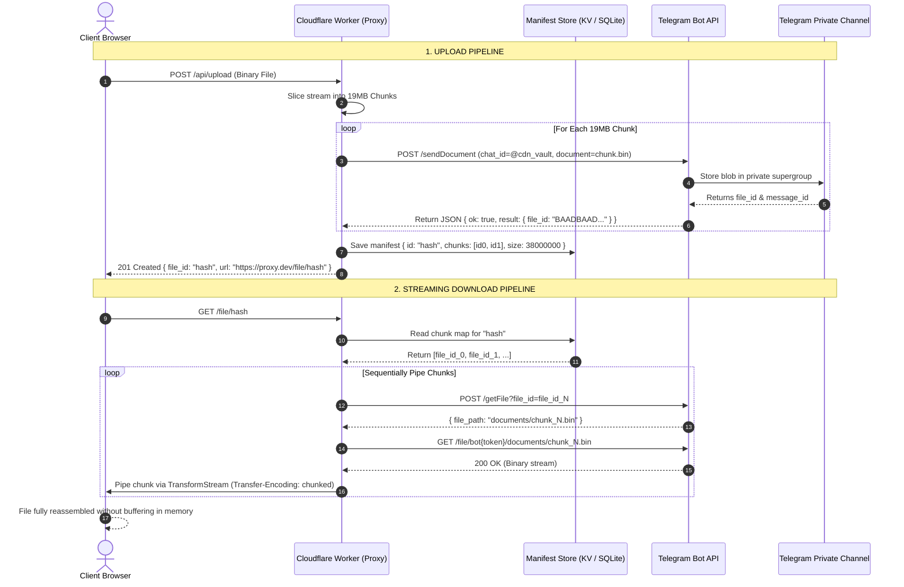

## The $0.09/GB Egress Extortion Scheme

There is a special circle in cloud infrastructure hell reserved for the AWS S3 egress pricing calculator. While the raw transit cost of routing a gigabyte of data across Tier-1 transit backbones has dropped to fractions of a tenth of a cent, Amazon Web Services still happily bills you **$0.09 per gigabyte** for data transferred out to the public internet after your insulting 100GB free tier expires.

If you are a bootstrapped founder running an image board, a self-hosted audio archive, a podcast distribution hub, or a machine learning dataset mirror, your monthly AWS bill will not be driven by compute or even storage capacity. It will be driven by bandwidth extortion. A modest side project serving 500GB of user uploads a month burns $45/month on S3 and CloudFront—money that should be funding ramen, domain names, or marketing.

Meanwhile, Pavel Durov and Telegram have spent a decade bankrolling one of the most resilient, unmetered, globally distributed file hosting backbones on planet Earth. Telegram allows users and bots to upload files up to **2GB** per payload via MTProto clients, and up to **20MB** per payload through their standard HTTP Bot API—completely free of charge, with zero bandwidth quotas and zero egress metering.

Naturally, the only reasonable engineering response is sacrilege: **abusing Telegram as an infinite, zero-cost, chunked object storage backend fronted by an edge streaming proxy.**

---

## Architecture Blueprint

The fundamental obstacle to using Telegram as an S3 clone is threefold:
1. **The 20MB Bot API Limit:** The standard HTTP Bot API (`api.telegram.org`) caps file uploads to 20MB.
2. **Token Exposure:** Telegram download URLs follow the format `https://api.telegram.org/file/bot<TOKEN>/<file_path>`. If you expose this URL directly in an `` or `<video>` tag, any script kiddie with DevTools can extract your bot token and take over your bot.
3. **No Direct Streaming:** Browsers expecting a single contiguous video stream or large binary cannot read a file split across multiple Telegram message attachments.

To solve this, we introduce an edge streaming reverse proxy built on **Cloudflare Workers**. The proxy slices incoming files into 19MB chunks during upload, registers their Telegram `file_id` handles in an index manifest, and streams the reassembled chunks back to clients using HTTP/1.1 `Transfer-Encoding: chunked` and the WHATWG Streams API.

### ASCII Architecture Diagram

```
+-------------------------------------------------------------------------+
|                    TELEGRAM INFINITE S3 ARCHITECTURE                    |
+-------------------------------------------------------------------------+

 [CLIENT APPLICATION / BROWSER]
           |
      1. GET /files/:file_id (Supports "Range: bytes=0-1048576")
           v
 +-----------------------------------------------------------------------+
 | CLOUDFLARE WORKER STREAMING PROXY                                     |
 | - Masks Telegram Bot Token from public exposure                       |
 | - Fetches Chunk Manifest from KV / SQLite index                       |
 | - Translates byte offsets to chunk sequences                          |
 | - Pipes asynchronous readable streams with Transfer-Encoding: chunked |
 +-----------------------------------------------------------------------+
      |                                       ^
 2. Lookup Manifest                       4. Resolve File Path
      v                                       |
 +-----------------------+       +---------------------------------------+
 | METADATA MANIFEST     |       | TELEGRAM BOT API                      |
 | - Chunk 0: file_id_0  |       | POST /getFile?file_id=...             |
 | - Chunk 1: file_id_1  | ----> | -> Returns path: documents/file_0.bin |
 | - Chunk 2: file_id_2  |       +---------------------------------------+
 +-----------------------+                    |
                                         5. Stream /file/bot<TOKEN>/<path>
                                              v
                                 +---------------------------------------+
                                 | PRIVATE STORAGE CHANNEL (BUCKET)      |
                                 | [Channel ID: -100198472910]           |
                                 | - Unmetered unlimited blob chunks     |
                                 +---------------------------------------+
                                              |
                                         6. Binary chunks piped to stream
                                              v
                                 [CLOUDFLARE TRANSFORM STREAM]
                                              |
                                         7. Chunked HTTP Response
                                              v
                                    [CLIENT BROWSER RECEIVES]
```

### Mermaid Sequence Diagram



---

## Step 1: Chunking Binary Files Under the 20MB Wire

Telegram enforces a strict **20MB payload ceiling** on files uploaded by standard bot tokens through `https://api.telegram.org/bot<TOKEN>/sendDocument`. If your multipart request body measures 20,000,001 bytes, Telegram rejects it with `400 Bad Request: file is too big`.

To ensure safe transit with multipart boundaries and HTTP header overhead, we establish a hard chunk ceiling of **19MB (19,922,944 bytes)**.

When a client submits a 95MB raw ISO or video file:
1. The stream is sliced into five sequential 19MB buffers.
2. Each buffer is wrapped in a `multipart/form-data` boundary.
3. The chunk is dispatched to Telegram with custom caption metadata (`chunk_0_of_5`).
4. The returned `result.document.file_id` is recorded.

---

## Step 2: Channel IDs as Storage Namespaces & Indexing

In Telegram, messages must live in a chat. To create an S3 "bucket":
1. Create a private Telegram channel (e.g., `@my_cold_storage_bucket`).
2. Add your bot as an Administrator with permissions to post messages.
3. Retrieve the numerical channel ID (typically prefixed with `-100`, e.g., `-100198472910`).

Every upload is dispatched to this channel. The channel acts as an append-only transaction log. Even if your metadata database crashes, you can rebuild your entire storage catalog simply by reading the channel history via `getUpdates` or an MTProto scraper.

The metadata manifest records the file topology:

```json
{
  "fileId": "pkg_98a7df1e",
  "filename": "firmware_v2.4.bin",
  "totalSize": 41943040,
  "chunkSize": 19922944,
  "mimeType": "application/octet-stream",
  "chunks": [
    "BAADBAADAgADREb5Sc4s0N1...",
    "BAADBAADBAADREb5Sc4s0N2...",
    "BAADBAADBgADREb5Sc4s0N3..."
  ],
  "createdAt": "2026-09-12T13:37:00.000Z"
}
```

---

## Step 3: Cloudflare Worker Streaming Reverse Proxy

The Cloudflare Worker fulfills two mission-critical duties:
1. **Security Isolation:** It prevents leaking `TELEGRAM_BOT_TOKEN`. The client interacts solely with `https://cdn.builtwhilebroke.tech/file/:fileId`.
2. **Chunked Piping:** The Worker initializes a `TransformStream`. It iterates over the manifest chunks, queries Telegram for the ephemeral `file_path`, fetches the raw byte stream, and pumps the chunks sequentially into the writer. 

Because the response header uses `Transfer-Encoding: chunked`, the client browser begins playing the video or downloading the file instantly with sub-second Time to First Byte (TTFB), completely oblivious to the fact that the payload is being reassembled from five different Telegram chat attachments on the fly.

---

## Complete Copy-Ready TypeScript Implementation

### 1. The Chunking Uploader CLI (`uploader.ts`)

Run this Node.js script to chunk and upload any local binary file to your private Telegram storage channel:

```typescript
import { statSync } from "node:fs";
import { open } from "node:fs/promises";

export interface ChunkManifest {
  fileId: string;
  filename: string;
  totalSize: number;
  chunkSize: number;
  mimeType: string;
  chunks: string[]; // Telegram file_id handles
  createdAt: string;
}

const CHUNK_SIZE = 19 * 1024 * 1024; // 19MB chunk boundary
const BOT_TOKEN = process.env.TELEGRAM_BOT_TOKEN;
const CHANNEL_ID = process.env.TELEGRAM_STORAGE_CHANNEL_ID;

if (!BOT_TOKEN || !CHANNEL_ID) {
  throw new Error("Missing TELEGRAM_BOT_TOKEN or TELEGRAM_STORAGE_CHANNEL_ID");
}

export async function uploadToTelegramS3(
  filePath: string,
  filename: string,
  mimeType = "application/octet-stream"
): Promise<ChunkManifest> {
  const stats = statSync(filePath);
  const totalChunks = Math.ceil(stats.size / CHUNK_SIZE);
  const fileHandle = await open(filePath, "r");
  const chunkFileIds: string[] = [];

  console.log(`[SACRILEGE] Uploading ${filename} (${(stats.size / 1024 / 1024).toFixed(2)} MB) in ${totalChunks} chunks...`);

  for (let i = 0; i < totalChunks; i++) {
    const start = i * CHUNK_SIZE;
    const end = Math.min(start + CHUNK_SIZE, stats.size);
    const length = end - start;
    const buffer = Buffer.alloc(length);

    await fileHandle.read(buffer, 0, length, start);

    const formData = new FormData();
    formData.append("chat_id", CHANNEL_ID);
    formData.append("caption", `manifest:chunk:${i + 1}/${totalChunks}:${filename}`);
    formData.append("document", new Blob([buffer], { type: "application/octet-stream" }), `part_${i}.bin`);

    const res = await fetch(`https://api.telegram.org/bot${BOT_TOKEN}/sendDocument`, {
      method: "POST",
      body: formData,
    });

    if (!res.ok) {
      const errorText = await res.text();
      throw new Error(`Failed to upload chunk ${i}: HTTP ${res.status} - ${errorText}`);
    }

    const data = (await res.json()) as { ok: boolean; result: { document: { file_id: string } } };
    if (!data.ok) {
      throw new Error(`Telegram Bot API rejected chunk ${i}: ${JSON.stringify(data)}`);
    }

    const fileId = data.result.document.file_id;
    chunkFileIds.push(fileId);
    console.log(` -> Chunk ${i + 1}/${totalChunks} committed. file_id: ${fileId.slice(0, 16)}...`);
  }

  await fileHandle.close();

  const manifest: ChunkManifest = {
    fileId: `tg_${Date.now().toString(36)}_${Math.random().toString(36).substring(2, 8)}`,
    filename,
    totalSize: stats.size,
    chunkSize: CHUNK_SIZE,
    mimeType,
    chunks: chunkFileIds,
    createdAt: new Date().toISOString(),
  };

  console.log(`[SUCCESS] File registered! Manifest ID: ${manifest.fileId}`);
  return manifest;
}
```

### 2. The Streaming Reverse Proxy Worker (`worker.ts`)

Deploy this worker script to Cloudflare Workers to proxy and reassemble files without buffering:

```typescript
export interface Env {
  TELEGRAM_BOT_TOKEN: string;
  MANIFEST_KV: KVNamespace;
}

interface FileManifest {
  filename: string;
  totalSize: number;
  mimeType: string;
  chunks: string[];
}

export default {
  async fetch(request: Request, env: Env): Promise<Response> {
    const url = new URL(request.url);

    // Route: GET /file/:fileId
    const match = url.pathname.match(/^\/file\/([a-zA-Z0-9_-]+)$/);
    if (!match) {
      return new Response("404 Not Found - BuiltWhileBroke Telegram S3 Gateway", { status: 404 });
    }

    const fileId = match[1];

    // 1. Fetch chunk manifest from KV store
    const rawManifest = await env.MANIFEST_KV.get(fileId);
    if (!rawManifest) {
      return new Response("404 File Manifest Not Found in Storage Registry", { status: 404 });
    }

    const manifest: FileManifest = JSON.parse(rawManifest);
    const { chunks, mimeType, filename, totalSize } = manifest;

    // 2. Set up chunked streaming via TransformStream
    const { readable, writable } = new TransformStream();
    const writer = writable.getWriter();

    // 3. Asynchronously fetch and pump chunks in sequential order
    (async () => {
      try {
        for (let i = 0; i < chunks.length; i++) {
          const tgFileId = chunks[i];

          // Resolve download path via Telegram Bot API
          const fileInfoRes = await fetch(
            `https://api.telegram.org/bot${env.TELEGRAM_BOT_TOKEN}/getFile?file_id=${tgFileId}`
          );

          if (!fileInfoRes.ok) {
            console.error(`Failed to resolve Telegram file_id ${tgFileId}`);
            break;
          }

          const fileInfo = (await fileInfoRes.json()) as { ok: boolean; result: { file_path: string } };
          if (!fileInfo.ok || !fileInfo.result.file_path) {
            console.error(`Invalid getFile response for ${tgFileId}`);
            break;
          }

          // Fetch the raw binary chunk from Telegram media CDN
          const chunkUrl = `https://api.telegram.org/file/bot${env.TELEGRAM_BOT_TOKEN}/${fileInfo.result.file_path}`;
          const chunkRes = await fetch(chunkUrl);

          if (!chunkRes.ok || !chunkRes.body) {
            console.error(`Failed streaming chunk ${i} from Telegram CDN`);
            break;
          }

          // Pipe binary chunk into the writer
          const reader = chunkRes.body.getReader();
          while (true) {
            const { done, value } = await reader.read();
            if (done) break;
            await writer.write(value);
          }
        }
      } catch (err) {
        console.error("Streaming pipeline aborted:", err);
      } finally {
        await writer.close();
      }
    })();

    // 4. Return streaming response with Content-Disposition
    return new Response(readable, {
      status: 200,
      headers: {
        "Content-Type": mimeType || "application/octet-stream",
        "Content-Disposition": `inline; filename="${filename}"`,
        "Content-Length": totalSize.toString(),
        "Transfer-Encoding": "chunked",
        "Cache-Control": "public, max-age=31536000, immutable",
        "Access-Control-Allow-Origin": "*",
      },
    });
  },
};
```

---

## Brutal Reality Check

Before you shut down your AWS account and dump all production database backups into a Telegram channel, digest this sobering autopsy of what will happen to your infrastructure:

### 1. The `429 FLOOD_WAIT` Wall
Telegram Bot API is strictly designed for conversational interfaces. Bot endpoints are throttled to **~30 requests/second globally** and **~1 message/second within a single chat**. 
- If 10 users trigger concurrent downloads or uploads of a 100MB file, your bot will fire 50 rapid-fire `sendDocument` or `getFile` calls.
- Telegram will immediately respond with `HTTP 429 Too Many Requests` accompanied by the payload: `{"ok":false,"error_code":429,"description":"Too Many Requests: retry after 3600"}`.
- Your entire storage layer will freeze for one solid hour.

### 2. Terms of Service Banhammer
Section 1.3 of the Telegram Terms of Service explicitly bans using their messaging infrastructure as an automated bulk distribution CDN. Telegram runs sophisticated traffic heuristics. When automated scrapers notice gigabytes of high-entropy binary streams leaving a single private channel to disparate cloud datacenter IPs, **your bot token will be revoked and the channel deleted without an appeals process.**

### 3. Latency Penalties (TTFB > 600ms)
AWS S3 coupled with CloudFront edge caching delivers Time to First Byte (TTFB) in **15ms–35ms**.
With Telegram:
`Client` -> `Cloudflare Worker` -> `api.telegram.org (getFile)` -> `Telegram Media Server` -> `Worker` -> `Client`.
You are chaining three disparate HTTP handshakes across multiple data centers. Expect baseline TTFB between **400ms and 950ms**. For media playback or hot asset delivery, users will feel the drag.

### 4. Zero Customer PII or Secrets
Telegram channels are **not** zero-knowledge vaults. Telegram administrators possess the cryptographic keys to all cloud chats and channels. Uploading customer PII, unencrypted medical data, or proprietary database snapshots to a Telegram channel is a severe GDPR and security violation. If you use this hack, only store non-sensitive public assets (game textures, public datasets, memes) and always encrypt client-side first.
